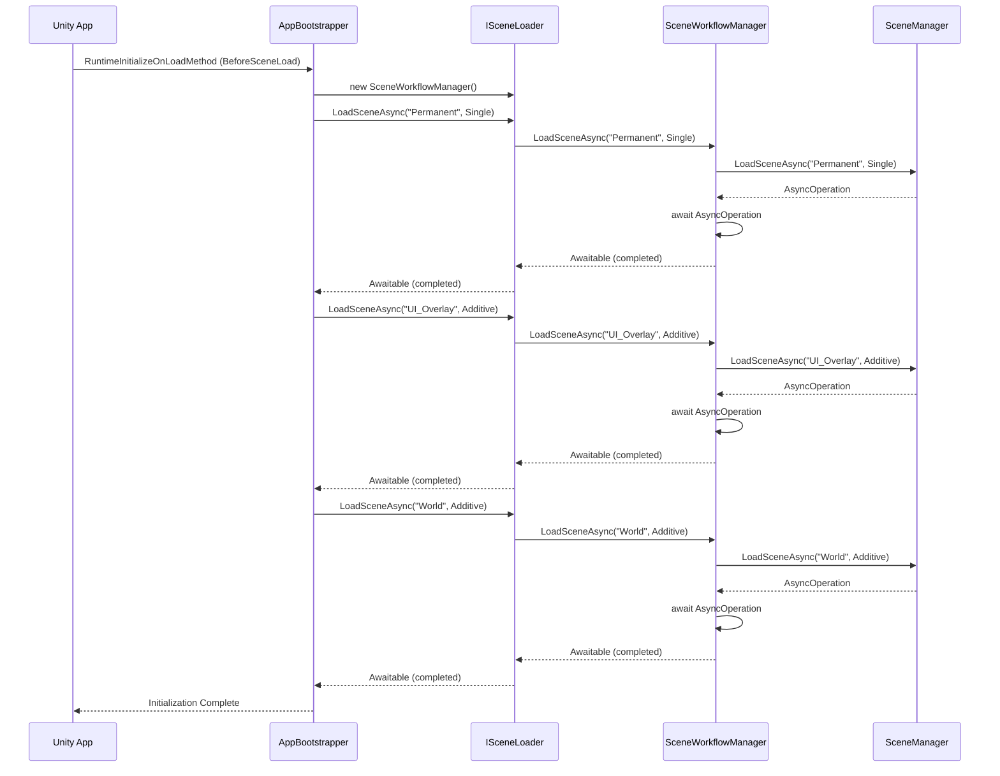
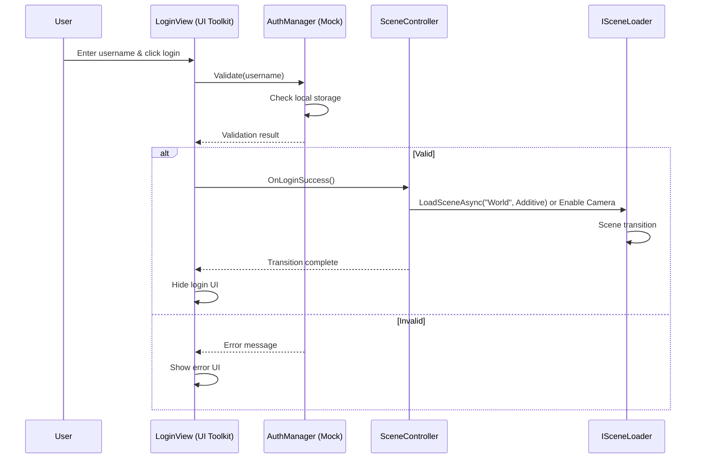

# SEQUENCE.md - 処理フロー

## アプリ起動シーケンス

## ログイン実行シーケンス

## シーンフロー概要
1. **起動**: AppBootstrapper が Permanent → UI_Overlay → World の順でロード
2. **ログイン**: UI_Overlay の LoginView で認証
3. **遷移**: 成功時 World シーン有効化、3D空間操作開始
4. **操作**: モデル配置、ネットワーク同期などの機能実行

## 非同期処理フロー
- 全てのシーン読み込みは `async Awaitable` メソッド経由
- `ISceneLoader` インターフェースで疎結合
- エラー時は `InvalidOperationException` スロー
- 完了までUIブロッキングなし